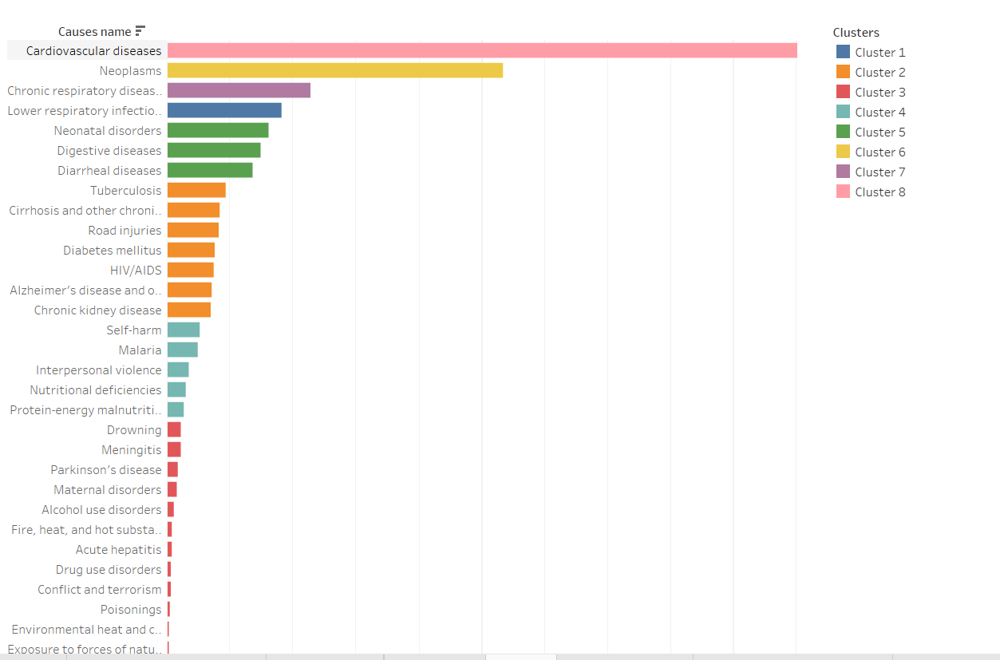
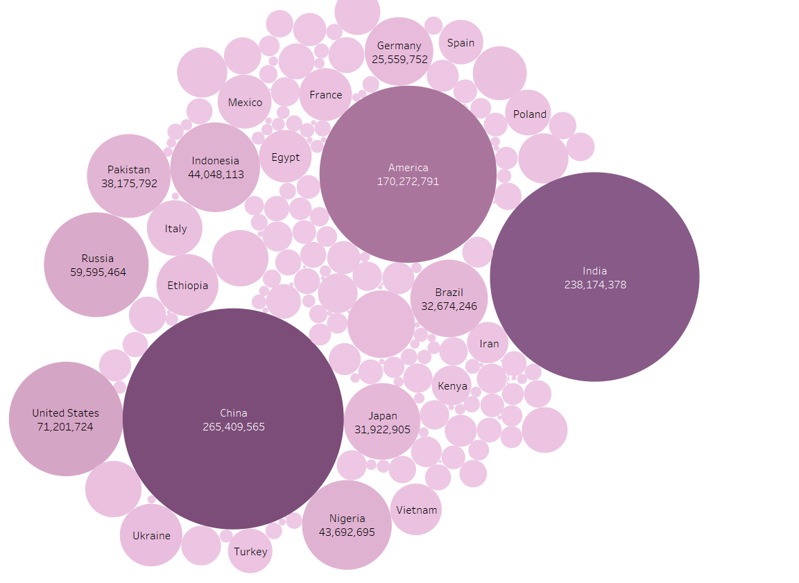
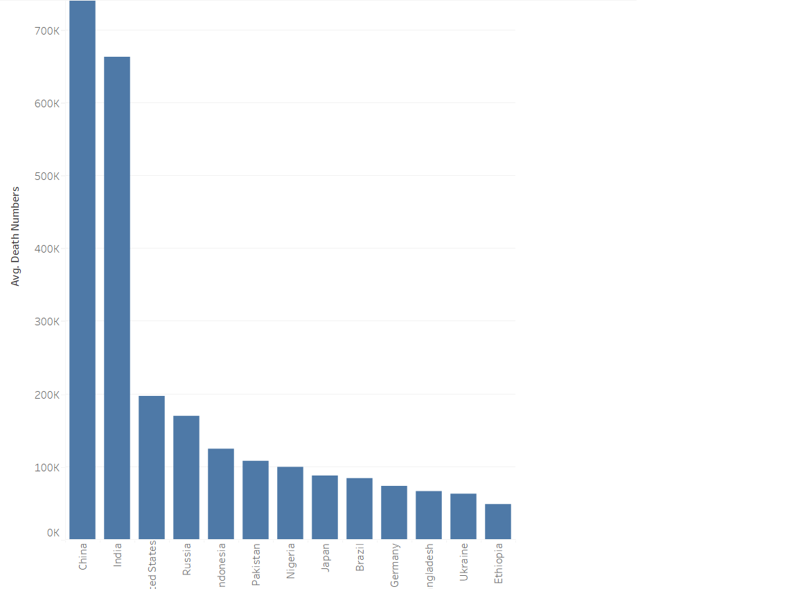
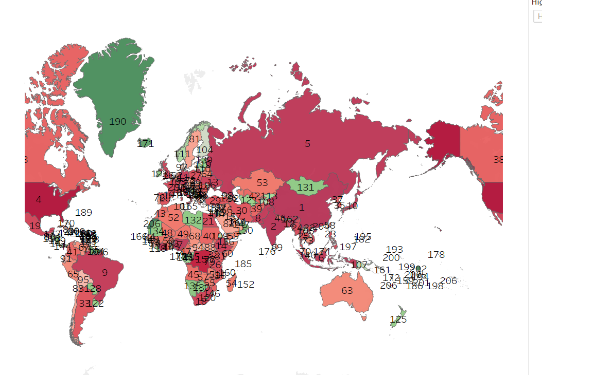

# Final-Project-Tableau

## Project/Goals
The main goal of the project is to generate different visualization from the dataset and created easiest way to understand and explore a data from the dataset.

## Process
### (your step 1)
Downloaded Tableau
Created Account in Tableau public.

### (your step 2)
I selected Option 2 dataset is [Cause of Death - Our World In Data](https://www.kaggle.com/datasets/ivanchvez/causes-of-death-our-world-in-data?resource=download).

The Global Burden of Disease is a major global study on the causes of death and disease published in the
medical journal The Lancet. These estimates of the annual number of deaths dataset are shown here.
Downloaded https://ourworldindata.org/causes-of-death dataset from the first chart as CSV.
In these dataset covered number of death people in last 40 years with country name and causes of their death.

In this dataset has 2 CSV file: 
(1) annual-number-of-deaths-by-cause.csv
(2) Causes Of Death Clean Output V2.0.csv
Import both CSV files into Tableau database and created reationship between them by country code.

There are many important questions that helps to understand data in detail:

What caused people's death? 

How did the causes of death change over time and differ between different countries and world regions? 

Which country has the highest death of people?

Which disease is the most spread over the world?

which country has the highest number of death by causes?

which diseases have the lowest effect on the population?

Comparison of death by addiction in countries sort by income level.

Created forecasting for the highest and the lowest amount of people affected by diseases

## Results
(1) The Highest number of death by causes name:
    
Cardiovascular diseases are the leading cause of death globally. The second biggest cause are neoplasmas.

(2) Number of death in countries:
    

(3) The highest death of countries list:
     
china has become the country that has the highest people's dies due to a variety of diseases and the second one is India.

(4) Rank of countries in map:
 It is help to understand which country has morality rate is high.
    

These visualizations are the main overview of the data set.
Other visualization attached with PDF and tableau worksheet which explore more data from the dataset.

## Challenges 
(1)Data analysis is the biggest challenge because in this dataset most columns values are numeric.
(2)which kind of visualization is good for this dataset?
(3)I lost many visualizations when I am change data in the dashboard.
## Future Goals
If I have more time I will make the dashboard more interactive and also create more visualizations that help to understand the dataset.
